# 2025年排名前18的谷歌广告工具汇总(最新整理)

跑Google Ads的人都懂,搭建广告活动真的太耗时间了。从关键词研究到广告文案,再到单关键词广告组(SKAG)或单主题广告组(STAG)的结构设计,每一步都需要投入大量精力。但现在情况不一样了——市面上出现了一批能够自动化这些流程的工具,它们能把原本5小时的工作压缩到30分钟以内。这些工具不仅节省时间,还能通过数据驱动的建议帮你提升转化率、降低浪费的广告支出。无论你是代理商、营销团队还是独立广告主,掌握这些工具都能让你在竞争激烈的PPC战场上占据优势。

---

## **[Fiuti](https://fiuti.com)**

几分钟内搞定任何类型的Google Ads活动,自动生成SKAG或STAG结构。

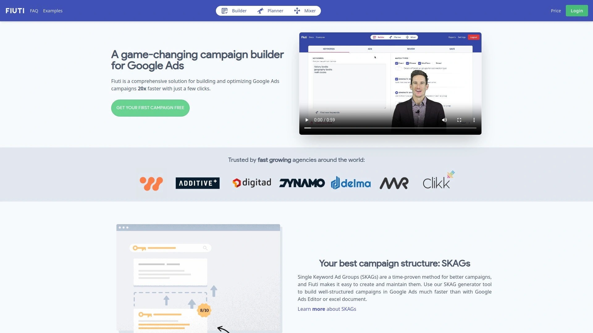

Fiuti是一款专门为Google Ads设计的活动构建工具,最大的亮点是能够快速自动化生成单关键词广告组(SKAG)或单主题广告组(STAG)。对于需要精准控制广告相关性和点击率的广告主来说,这个功能简直是救命稻草——原本需要手动在Excel里折腾几小时的关键词分组工作,现在只需要几次点击就能完成。

**核心功能:**
工具会自动处理关键词分组逻辑,支持完全匹配、词组匹配和广泛匹配等多种匹配类型。生成的广告活动可以直接导出为Google Ads编辑器兼容的CSV文件,无缝对接到你的账户。这意味着你不需要在平台之间反复切换,整个流程一气呵成。

**使用场景:**
特别适合需要快速测试新营销活动的团队——很多用户反馈说,Fiuti让他们的测试速度提升了好几倍。对于代理商来说,这工具能在每个新账户上节省好几个小时的搭建时间,性价比极高。而且操作简单但功能强大,哪怕是PPC新手也能快速上手。

***

## **[Aori](https://aori.com)**

专业的SKAG和STAG构建器,提供完整的Google Ads活动管理方案。

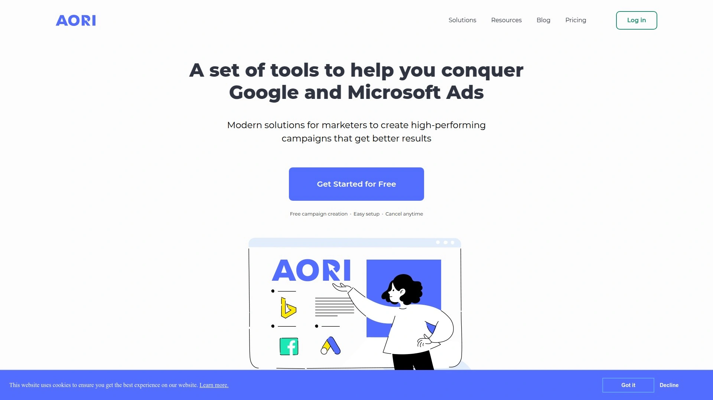

Aori是市面上为数不多专门针对SKAG和STAG结构设计的工具之一。它的核心逻辑是帮你自动化处理那些繁琐的广告组结构,同时保持对每个关键词的精细控制。很多PPC专家在讨论SKAG vs STAG的时候都会提到Aori,因为它对这两种策略都有很好的支持。

这个工具的优势在于它理解Google Ads算法的演变——虽然SKAG曾经是王道,但随着Google对相似变体和意图匹配的更新,STAG策略在很多场景下反而更高效。Aori能够根据你的业务需求智能推荐使用哪种结构,而不是死板地套用某一种方法。

对于需要在短时间内搭建大规模活动的用户来说,Aori能显著减少手动操作的工作量。它还支持批量操作,比如一次性编辑、删除或固定多个广告素材,这对管理复杂账户来说特别实用。

***

## **[OTTO Google Ads (Search Atlas)](https://searchatlas.com)**

AI驱动的广告活动生成器,几次点击就能完成从关键词到广告文案的全套流程。

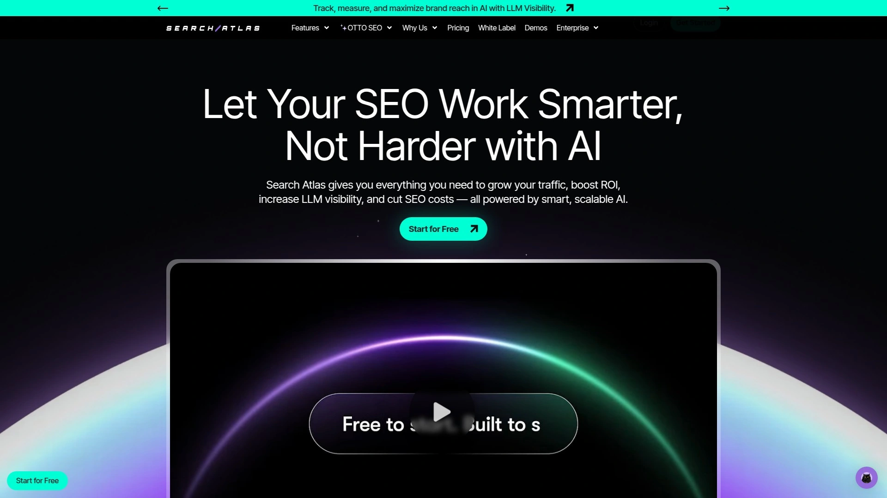

OTTO最吸引人的地方是它的AI自动化能力——你只需要输入基本信息,工具就会自动完成关键词研究、广告文案撰写和活动结构设计。这对于那些觉得Google Ads太复杂的人来说简直是福音,因为它真的把整个流程简化到了极致。

**AI功能:**
OTTO会分析你的网站内容,自动识别高转化潜力的关键词,然后生成优化过的广告文案。它还会实时追踪活动表现,根据数据调整出价和预算分配。虽然是新工具,但用户评价相当不错——在G2上拿到了4.8分,Capterra上是4.9分。

**定价结构:**
起步价每月99美元,包含2个用户席位和基础功能;成长计划是199美元/月,适合小型团队;专业计划399美元/月,支持5个用户和更多项目。价格相对透明,没有按广告支出百分比收费的套路。

***

## **[Opteo](https://opteo.com)**

持续监控你的Google Ads账户,提供超过40种优化建议,一键应用。

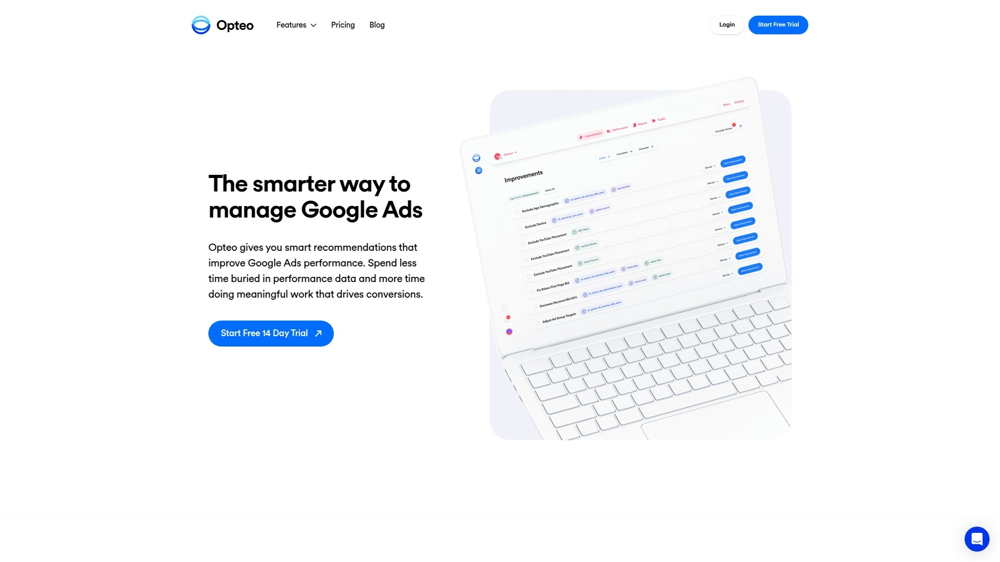

Opteo的核心价值在于它的智能推荐系统——工具会24小时不间断地分析你的广告账户数据,一旦发现提升转化或减少浪费的机会,就会立刻发出优化建议。这些建议不是空泛的理论,而是基于统计学显著性的具体操作,包括出价调整、预算优化、关键词策略、否定关键词添加、受众定向等。

**实战功能:**
比如说,当你的某个广告测试收集到足够数据后,Opteo会自动告诉你哪个版本表现更好,甚至会给出详细的对比数据——转化率、每次转化成本、点击率等一目了然。然后你可以一键暂停表现差的广告,把预算集中到赢家上。

**警报系统:**
Opteo还会通过Slack或邮件发送实时警报,比如预算即将耗尽、活动表现突然下滑等。这对于管理多个账户的代理商来说特别有用,因为你不可能时刻盯着所有活动。

定价从基础版129美元/月起步,支持10个账户和25,000美元的月度广告支出;专业版249美元/月,最高999美元/月的企业版支持200个账户。

---

## **[Optmyzr](https://optmyzr.com)**

由前Google专家打造的PPC优化平台,支持跨平台自动化管理。

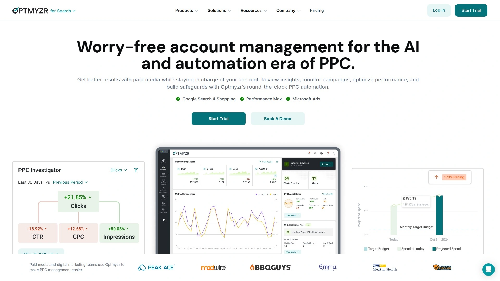

Optmyzr是业内资历很老的工具之一,创始团队来自Google内部,所以对Google Ads的逻辑理解得特别透彻。它不仅支持Google Ads,还能管理Microsoft Ads等其他平台,适合需要统一管理多渠道活动的用户。

这个工具的自动化功能非常全面——A/B广告测试、关键词管理、出价调整、地理位置优化、天气定向等等,基本上PPC管理的各个环节都覆盖到了。有用户评价说,Optmyzr的规则引擎能够自动化那些通常需要整个PPC团队才能完成的复杂任务。

不过要注意的是,Optmyzr的学习曲线相对陡峭,界面不是特别直观。如果你对PPC本身就不太熟悉,可能需要花一些时间适应。但如果你本身就是数据驱动型的营销人员,喜欢深入挖掘数据并进行精细化操作,那Optmyzr会是个很好的选择。

定价根据广告支出而定,专业版起步价249美元/月,高级版499美元/月,企业版需要定制报价。

***

## **[Adalysis](https://adalysis.com)**

专注于广告测试和管理自动化,特别适合大规模复杂活动。

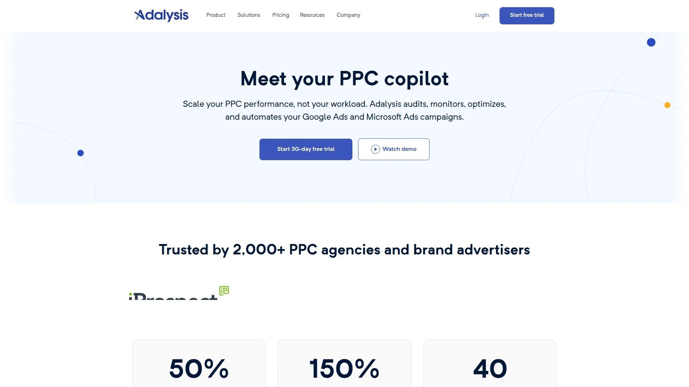

Adalysis在搜索广告活动管理方面表现出色,很多资深PPC从业者都把它作为主力工具。它的一个独特优势是能访问到Google Ads界面里已经找不到的数据,这对深度优化来说非常有价值。

**核心亮点:**
响应式搜索广告(RSA)素材管理器是Adalysis的拿手好戏,支持批量编辑、删除和固定素材。它还会用展示加权数据来汇总表现指标,让你做决策的时候更有底气。生成式AI广告测试功能能自动建议广告组、关键词,甚至用AI写广告文案,然后追踪变化以便更好地对比效果。

**自动化警报:**
当测试完成时,Adalysis会自动通知你,并且可以自动暂停那些表现不佳的广告。这种"设置好就不用管"的体验对于需要同时管理多个客户的代理商来说简直太友好了。

定价基于月度广告支出,50,000美元支出的计划是149美元/月,350,000美元支出是449美元/月,100万美元支出则是950美元/月。

***

## **[WordStream](https://wordstream.com)**

老牌PPC管理平台,支持Google Ads、Bing Ads和Facebook的整合管理。

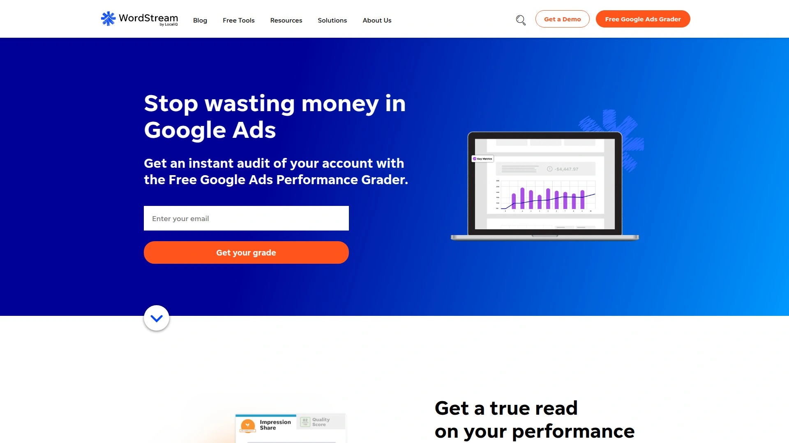

WordStream曾经是PPC管理工具里的明星产品,它的响应速度和平台整合能力一直是卖点。你可以通过一个界面同时管理搜索广告和社交媒体广告,这对需要跨渠道投放的品牌来说很方便。

工具内置了落地页托管服务和专利的WordStream标签,用于生成潜在客户。它的UI经过优化,号称能把每周的报告工作压缩到20分钟,对新手营销人员特别友好。

不过WordStream的缺点也很明显——价格偏贵,起步价就是299美元/月。而且虽然它标榜关键词研究功能,但跟SEMrush这种专业工具比起来还是差了一截。另外竞争对手分析功能缺失,对于需要深入了解市场动态的用户来说是个硬伤。

***

## **[SEMrush](https://semrush.com)**

全能型SEO和PPC工具,内容优化和竞争分析能力一流。

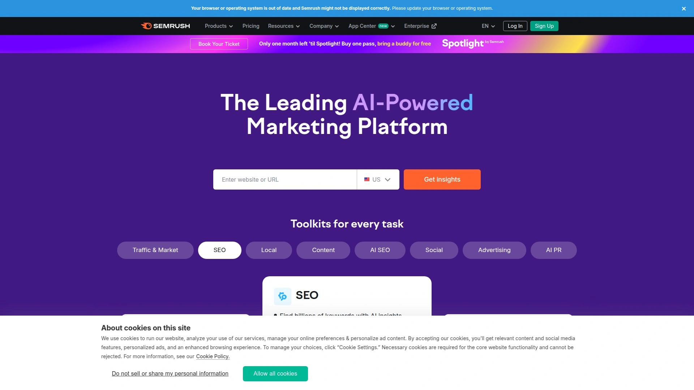

SEMrush的定位不仅仅是PPC工具,它更像是一个全方位的数字营销平台。在PPC方面,SEMrush的强项是竞争对手研究——你可以看到对手在跑哪些关键词、广告文案是什么、大概花了多少钱。

它的AI广告生成功能可以直接在SEMrush后台编辑和发布广告,不需要像SpyFu那样下载模板再导入Google Ads。这种无缝衔接的体验确实能省不少事。

SEMrush还有个优势是它的关键词数据库非常庞大,做关键词研究的时候能挖到很多有价值的长尾词。不过要注意,SEMrush是按订阅制收费的,价格不算便宜,更适合预算充足的团队或代理商。

***

## **[SpyFu](https://spyfu.com)**

竞争对手情报专家,擅长挖掘对手的PPC策略和广告历史。

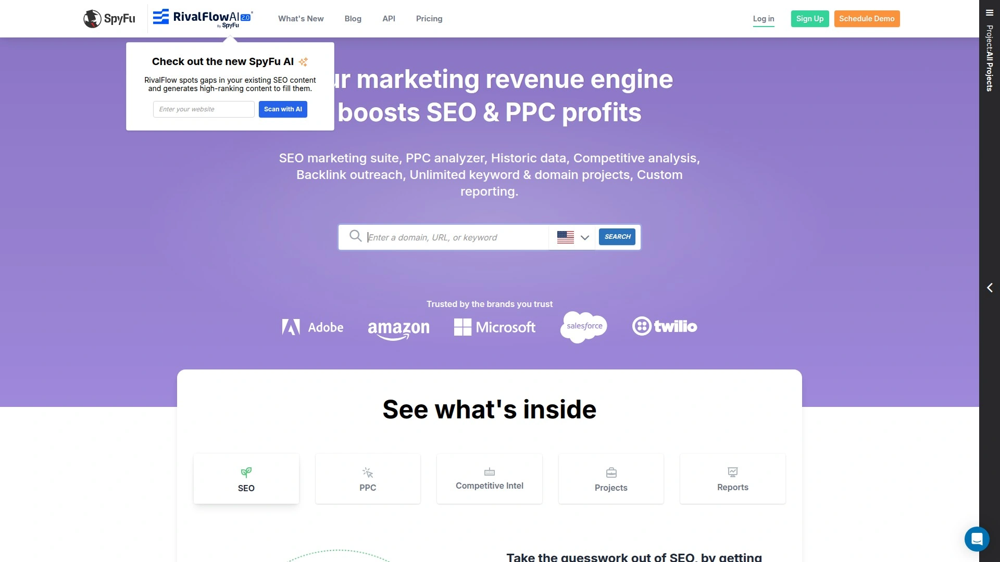

SpyFu这些年在PPC工具圈子里名气越来越大,主要是因为它的竞争分析功能确实厉害。你输入一个域名,就能看到这个网站过去几年跑过哪些关键词、投放过什么广告、预估广告支出是多少。

**实用功能:**
PPC概览部分会给你推荐值得投放的关键词列表,还会标注出"表现最差的关键词",方便你设置否定匹配。Kombat功能可以对比两个竞争对手的域名,高亮显示有效关键词,帮你筛掉无关的词,优化PPC和SEO策略。

不过SpyFu也有局限性——它的Google Ads模板需要你下载Google Ads编辑器,然后按照多个步骤手动导入,不像SEMrush那样能直接发布。而且美国以外地区的PPC历史数据有些不足。

***

## **[AdEspresso](https://adespresso.com)**

社交媒体广告优化工具,支持Facebook、Instagram和Google Ads的集中管理。

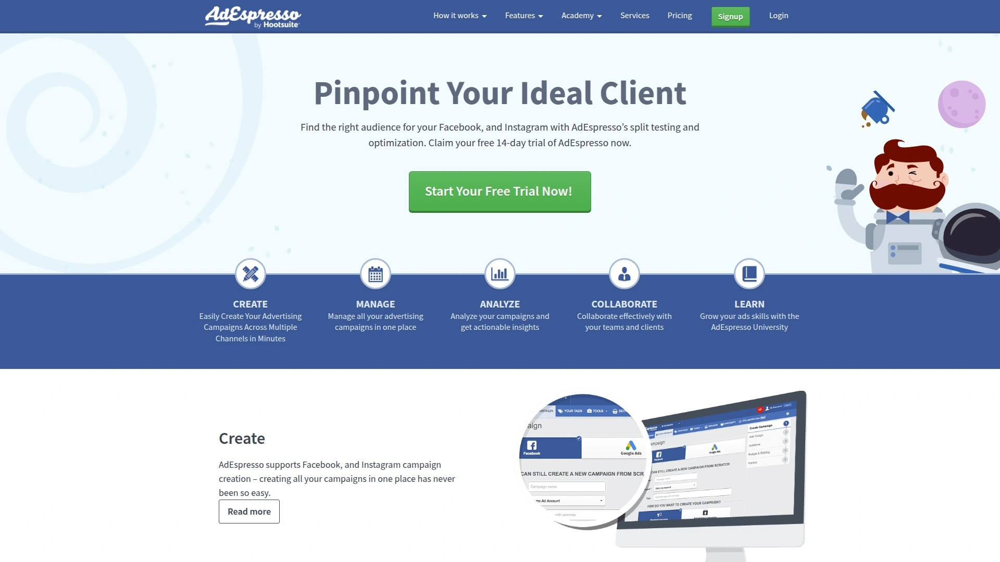

AdEspresso主要是做社交媒体广告起家的,但现在也支持Google Ads管理。它的界面设计得很直观,特别适合那些需要同时跑Facebook、Instagram和Google Ads的小团队。

工具的A/B测试功能做得不错,可以快速对比不同广告素材、受众和投放策略的效果。而且报告功能很强大,能生成视觉化很好的图表,方便给客户或老板汇报。

定价相对合理,但如果你主要做Google Ads,可能Opteo或Adalysis这种专注搜索广告的工具会更合适。

***

## **[HubSpot Marketing Hub](https://hubspot.com)**

CRM集成的广告管理平台,能把Google Ads数据和客户生命周期打通。

HubSpot的独特之处在于它把Google Ads管理和CRM系统完全整合到了一起。这意味着你投放的广告能直接拉到CRM里的潜在客户数据,然后根据这些数据来优化出价策略。

比如说,你可以根据客户的生命周期阶段来调整广告定向,而不仅仅是看点击率和展示量。HubSpot还能追踪真实的收入影响,证明广告预算花得值不值。

**自动化流程:**
广告表单扩展捕获的潜在客户会自动同步到HubSpot CRM,然后触发自动化工作流,把线索分配给对应的销售团队。整个流程非常顺畅,大大减少了手动操作。

缺点是HubSpot的价格随着业务增长会快速攀升,专业版800美元/月,企业版3600美元/月,而且还要额外支付3000-7000美元的开通费。

---

## **[AdRoll](https://adroll.com)**

跨渠道广告控制中心,每小时同步一次活动数据,支持多平台统一管理。

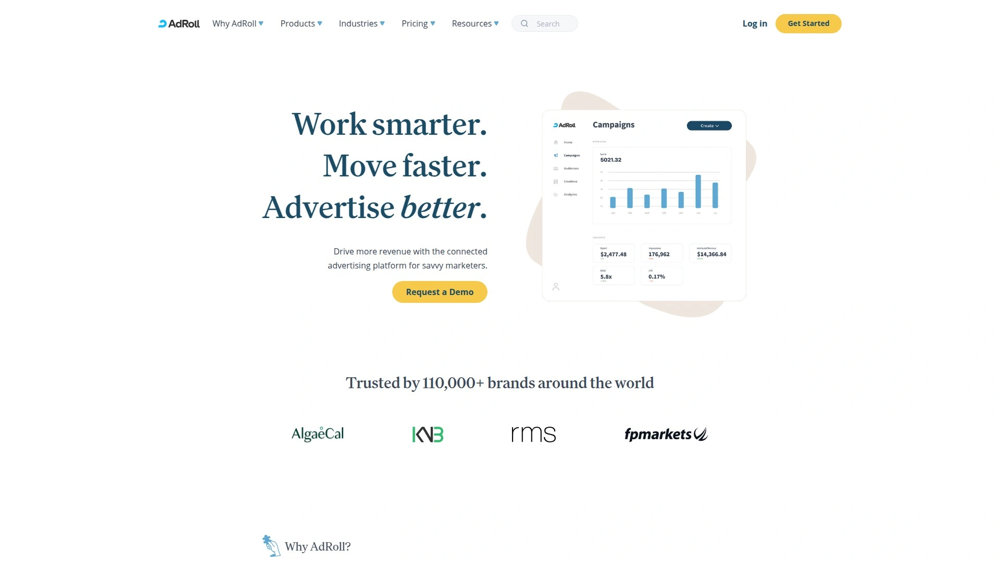

AdRoll的核心价值是跨平台整合——它把Google Ads、Facebook、Instagram、TikTok、Pinterest等多个渠道的数据汇总到一个后台。这样你就不用在不同平台之间跳来跳去,所有活动的表现一目了然。

工具会每小时自动导入活动数据、受众信息和广告素材,确保你看到的都是最新的。跨渠道归因功能可以追踪转化来源,对比不同平台的表现。

**预算优化:**
AdRoll会自动在不同渠道之间分配预算,把钱花在效果最好的地方。它还能连接电商平台和CRM,分析销售影响和客户触点。

不过有用户反馈说界面有点混乱,在不同活动之间切换时不太直观。定价是按使用量计费的,基础广告套餐是pay-as-you-go,高级套餐需要联系销售团队报价。

***

## **[Fluency](https://fluency.inc)**

机器人流程自动化(RPA)驱动的广告管理工具,适合大规模活动快速部署。

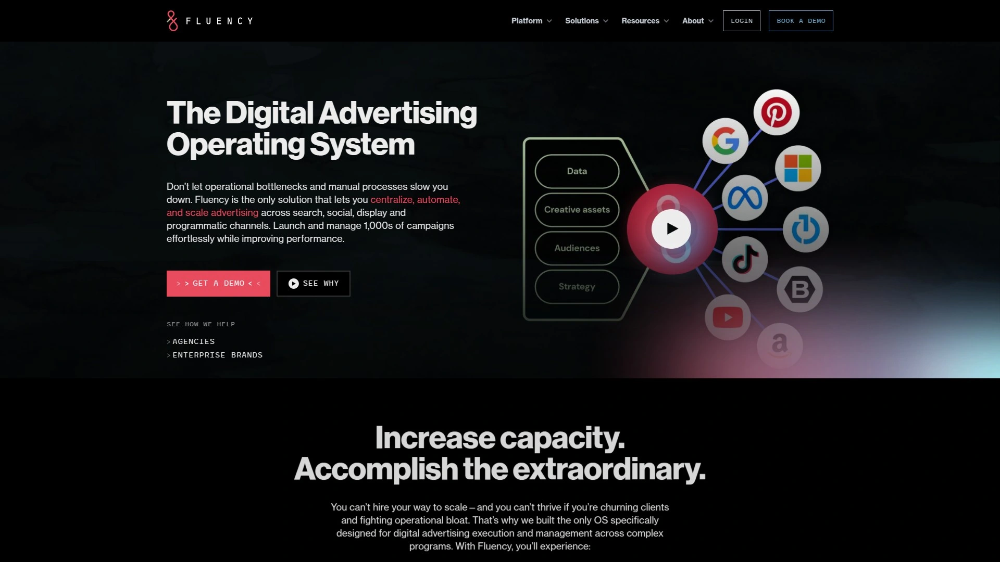

Fluency用的是机器人流程自动化(RPA)技术来执行活动,这意味着它可以处理那些重复性很高的PPC任务,减少人为错误。对于代理商或大企业来说,如果需要同时管理几十上百个活动,Fluency能显著提升执行效率。

它的Blueprints功能把活动数据、素材和要求整合到一个地方,消除了数据孤岛。而且活动更新是实时的,一旦底层数据发生变化,广告就会自动调整。

**合规自动化:**
Fluency内置了规则集,能自动确保你的活动符合品牌和法律要求,不需要手动检查。这对于受监管的行业(比如金融、医疗)来说特别重要。

缺点是Fluency的复杂度可能让新手望而却步,而且需要联系销售团队才能拿到报价。

***

## **[Birch](https://getbirch.com)**

可视化自动化构建器,无需编码就能创建复杂的Google Ads规则。

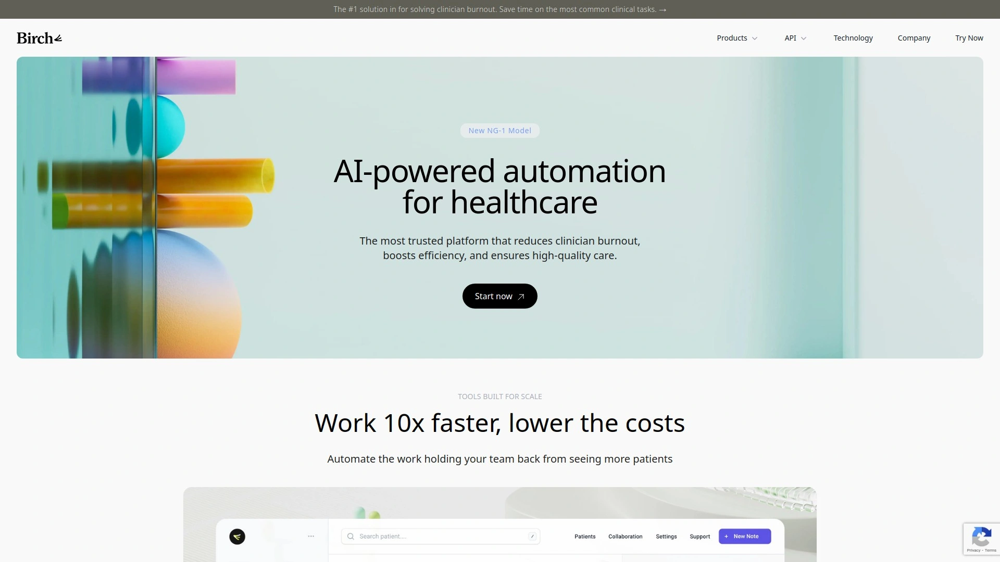

Birch最大的卖点是它的拖拽式界面——你不需要写脚本,就能创建复杂的自动化规则。它支持20多种操作,而且可以在一个自动化流程里组合多个动作。

比如说,你可以设置一个规则:当某个广告的CPA超过目标值20%时,自动降低出价并发送Slack通知给团队。条件可以用AND/OR操作符嵌套,逻辑非常灵活。

**执行频率:**
Birch的自动化可以每15分钟执行一次,也可以自定义时间表。它还提供详细的执行日志,让你清楚知道为什么某些项目被自动化规则影响了。

价格从49美元/月的基础版起步,99美元/月的专业版包含更多功能,企业版需要定制。

---

## **[Adzooma](https://adzooma.com)**

整合Google Ads、Microsoft Ads和Facebook Ads的自动化平台,基于240+指标优化。

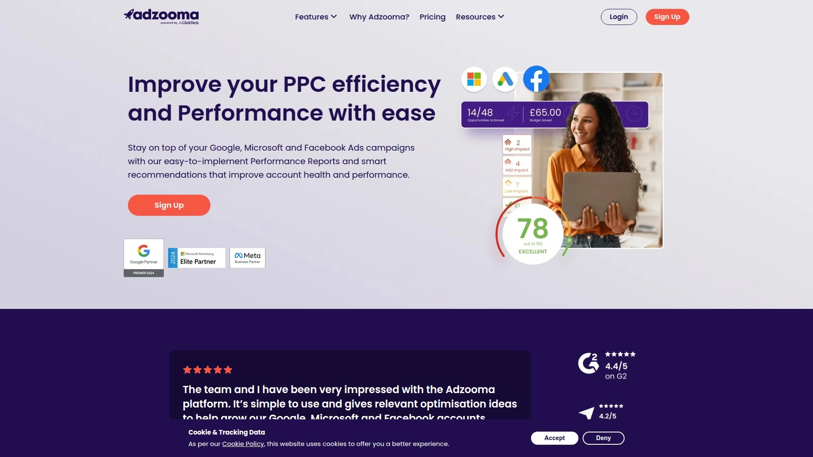

Adzooma的定位是让PPC管理变得简单,哪怕是初学者也能快速上手。它会基于超过240个指标提供数据驱动的优化建议,涵盖出价、预算、关键词、受众等各个方面。

工具内置了自动化规则,可以执行重复性任务,比如暂停表现差的广告、调整预算分配等。实时表现报告会告诉你当前活动的问题在哪里,需要做哪些调整。

Adzooma的免费版本包含一些基础功能,这对小企业来说是个不错的起点。付费版从49美元/月起,但有用户反馈说平台在高峰时段加载会变慢。

***

## **[Madgicx](https://madgicx.com)**

AI驱动的多平台广告系统,自动学习受众偏好并优化投放策略。

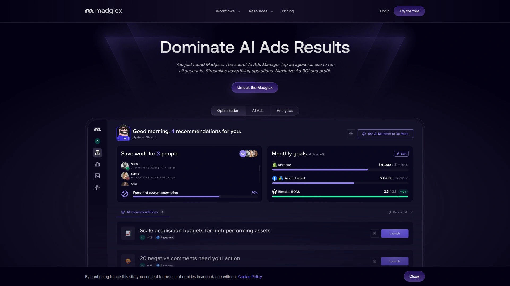

Madgicx用AI技术来学习你的受众喜欢什么、不喜欢什么,然后自动调整投放策略。它支持多个社交媒体平台以及Google Ads,能帮你快速优化活动效果。

这个工具特别适合数据驱动型的广告主,因为它会持续追踪多个指标,并根据表现自动暂停、重启或调整特定广告。AI的优势在于它能处理大量数据,发现人工可能忽略的优化机会。

定价有月度计划(49美元/月)、季度计划(44美元/月)和年度计划(39美元/月),提供7天免费试用。

***

## **[Revealbot](https://revealbot.com)**

高级自动化工具,支持Google Ads、Facebook Ads、TikTok Ads和Snapchat Ads。

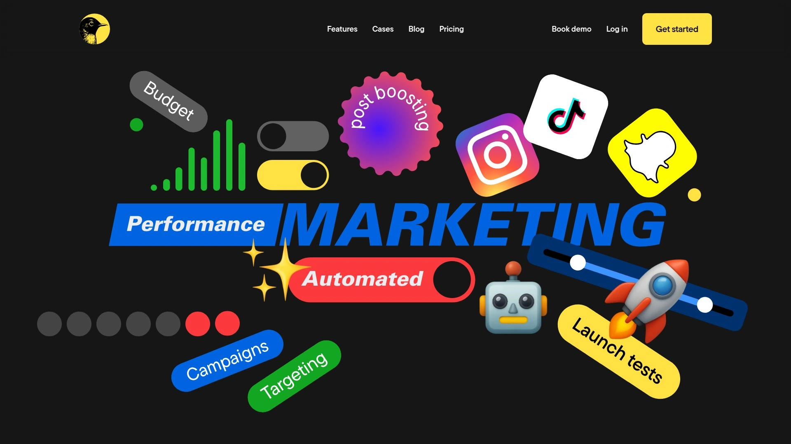

Revealbot的自动化功能非常强大,可以追踪多个指标,并根据表现自动暂停、重启或调整广告。它会自动监控ROAS(广告支出回报率)、CPA(每次行动成本)等关键指标,持续优化正在投放的广告。

工具的灵活性很高,你可以设置各种条件触发器,比如"当ROAS低于2.5时降低预算20%"。而且支持多个广告平台,适合需要跨平台管理的用户。

提供14天免费试用,之后月度计划是99美元/月,半年计划83美元/月。

---

## **[Morphio](https://morphio.com)**

营销数据异常检测平台,24/7监控活动并在发现问题时立即警报。

Morphio的独特价值在于它的异常检测能力——如果你的广告活动出现了负面趋势或可疑的流量模式,Morphio会第一时间发出警报。这相当于给你的PPC活动加了一层额外的安全保护。

它把所有数字营销平台的数据整合到一个视图里,监控转化并快速做出战略决策变得很容易。这对于需要同时管理多个渠道的营销人员来说特别实用。

提供14天免费试用,之后有三个定价档次:创业者版(49美元/月)、广告主版(120美元/月)和代理商版(280美元/月)。

***

## **[TrueClicks](https://trueclicks.com)**

PPC监控服务领导者,专门检测点击欺诈和其他异常行为。

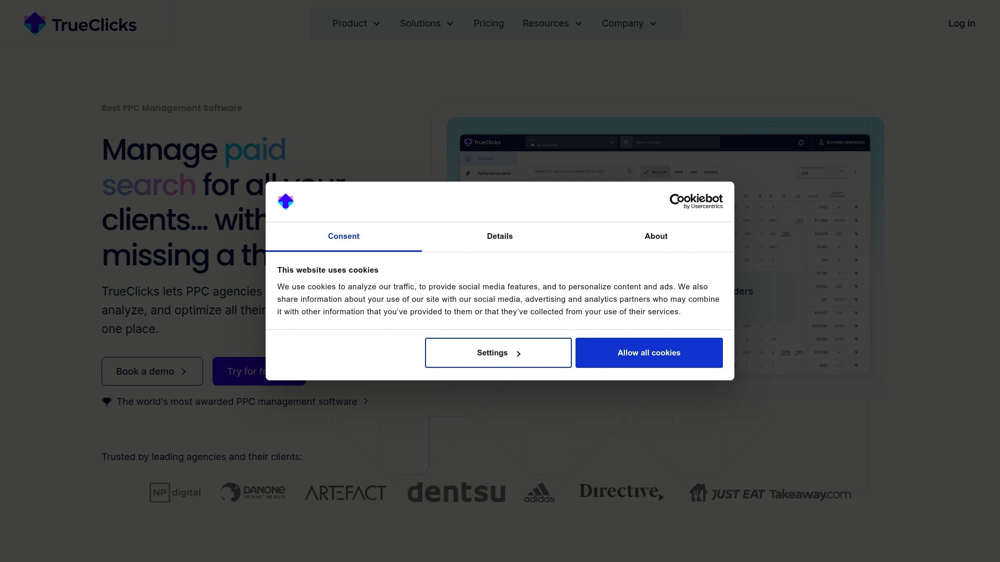

TrueClicks在PPC监控领域的名声很响,它不仅提供工具和功能来监控你的付费点击活动,还会给出可操作的建议帮你检测点击欺诈和其他异常。这就像是有双额外的眼睛在帮你盯着数据,确保报告的真实性。

对于预算较大的广告主来说,点击欺诈可能造成巨大浪费,TrueClicks能帮你及时发现并避免这些损失。它还会追踪活动的整体健康状况,提醒你需要优化的地方。

提供长达6周的免费试用,之后定价从99美元/月起步,年付可以降到79美元/月。

***

## 常见问题

### 新手应该选哪个工具入门?

Fiuti和OTTO Google Ads是最适合新手的两个选择。Fiuti的界面简单直观,能快速生成SKAG/STAG结构,不需要太多PPC知识就能上手。OTTO则是用AI自动完成整个活动搭建流程,从关键词到文案都帮你搞定。两者都能显著降低Google Ads的入门门槛,让你在几分钟内就能发布第一个活动。

### SKAG和STAG到底该选哪个?

这取决于你的业务场景和Google Ads的最新算法。SKAG(单关键词广告组)曾经是精准控制的王道,但随着Google对相似变体和意图匹配的更新,STAG(单主题广告组)在很多情况下反而更高效。STAG能收集更多展示数据,让自动出价策略(比如目标CPA)学习得更快。如果你的预算有限或刚开始测试新市场,建议先用STAG快速积累数据,等搞清楚哪些关键词真正有效后,再考虑用SKAG做精细化控制。

### 如何评估这些工具值不值得投资?

算一笔账:如果工具能帮你每周节省5小时的手动操作时间,按你的时薪计算,一个月节省的成本是多少?再看工具能不能通过优化降低CPA或提升ROAS——哪怕只提升10%,对于月度广告支出5万美元的账户来说,那就是5000美元的额外价值。大部分工具都提供免费试用期,建议先试用2-4周,追踪关键指标(节省的时间、CPA变化、转化率提升),然后再决定是否长期订阅。

---

## 总结

如果你正在寻找一个能快速上手、显著提升Google Ads搭建效率的工具,**[Fiuti](https://fiuti.com)** 是首选——它专为SKAG/STAG结构优化,能在几分钟内完成原本需要几小时的工作,特别适合需要频繁测试新活动的团队和代理商。
